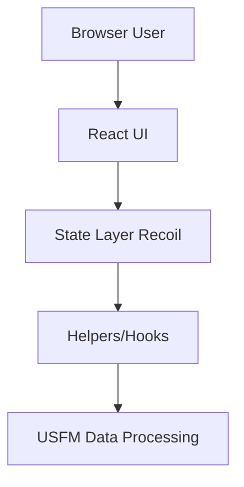
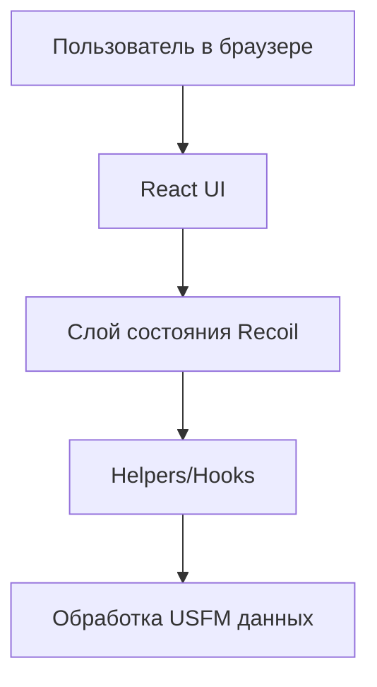

# my-usfm-editor

## English

## Problem
Teams working with USFM scripture files need a browser-based editor with fast iteration and deployment-friendly frontend architecture.

## Solution
`my-usfm-editor` is a React + Vite web application for editing and navigating USFM-related content with modular UI/state layers.

## Tech Stack
- Node.js
- React
- Vite
- Tailwind CSS
- Recoil
- Axios

## Architecture
Top-level structure:
```text
src/
renderer/
helpers/
hooks/
data/
index.html
vite.config.js
```



## Features
- USFM-oriented editing workflow in browser
- Modular frontend structure (`src`, `renderer`, `helpers`, `hooks`)
- Build and preview flow via Vite
- Styling with Tailwind CSS

## How to Run
```bash
yarn install
yarn dev
```

Build for production:
```bash
yarn build
yarn preview
```

## Русский

## Проблема
Командам, работающим с USFM-текстами, нужен браузерный редактор с быстрой итерацией и удобной архитектурой фронтенда.

## Решение
`my-usfm-editor` — это React + Vite приложение для редактирования и навигации по USFM-контенту с модульной структурой UI и состояния.

## Стек
- Node.js
- React
- Vite
- Tailwind CSS
- Recoil
- Axios

## Архитектура
Верхнеуровневая структура:
```text
src/
renderer/
helpers/
hooks/
data/
index.html
vite.config.js
```



## Возможности
- Браузерный workflow для USFM-редактирования
- Модульная структура фронтенда (`src`, `renderer`, `helpers`, `hooks`)
- Сборка и предпросмотр через Vite
- Стилизация через Tailwind CSS

## Как запустить
```bash
yarn install
yarn dev
```

Сборка для production:
```bash
yarn build
yarn preview
```
